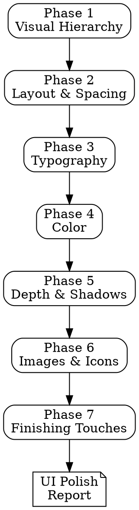

# UI Polish Review

## Overview

A structured visual design audit methodology based on *Refactoring UI* by Adam Wathan and Steve Schoger. Guides you through 7 sequential phases to systematically evaluate and improve the visual quality of any web or application interface, transforming rough or inconsistent designs into polished, professional ones.

## When to Use

- Before launching a product or feature to production
- When a design "looks off" but you cannot pinpoint why
- During design reviews or code reviews that include UI changes
- When elevating a functional prototype into a polished product
- After implementing a design and wanting to verify visual quality against best practices
- When onboarding a new team and establishing design standards

## When NOT to Use

- As a substitute for usability testing (use the ux-usability-review skill for that)
- For branding or marketing strategy decisions
- When the interface is still in wireframe stage and visual design has not started yet
- For accessibility-only audits (though contrast is covered here, a full a11y audit requires more)

## Process

Work through each phase **sequentially**. At each phase:

1. **Ask** targeted questions about the specific interface being reviewed
2. **Read** the relevant chapter summary from `front-end-design/refactoring-ui/` for detailed guidance
3. **Suggest and execute** concrete tests (grep patterns in source code, visual inspection checklists, automated checks)
4. **Flag findings** with severity: `CRITICAL` / `HIGH` / `MEDIUM` / `LOW` / `INFO`
5. **Summarize** findings before moving to the next phase

If the application does not have a relevant surface for a phase (e.g., no user-uploaded images), acknowledge and skip with rationale.



---

## Phase 1: Visual Hierarchy

**Reference:** `front-end-design/refactoring-ui/ch02-hierarchy-is-everything.md`

**Goal:** Verify that the interface communicates a clear, intentional visual hierarchy so users instantly know what is most important, secondary, and tertiary.

**Questions to ask:**
- Is hierarchy communicated through a combination of font weight, color, and size -- not size alone?
- Are labels used only when the data format is not self-explanatory? (Email addresses, phone numbers, dates, and currencies rarely need labels.)
- Are secondary and tertiary actions properly de-emphasized? (Outlined or text-only buttons, muted colors, smaller size.)
- Is document hierarchy (h1, h2, h3) independent from visual hierarchy? (An h2 can be visually smaller than a paragraph if that serves the design.)
- Are destructive actions de-emphasized rather than given prominent red buttons?
- Is the "emphasize by de-emphasizing" technique used -- making surrounding elements quieter rather than making the primary element louder?

**Tests to run:**
```
# Find font-size declarations without corresponding weight/color differentiation
# Red flag: many different font-sizes but uniform font-weight and color
grep -rn "font-size" --include="*.css" --include="*.scss" --include="*.tsx" --include="*.jsx"

# Find multiple primary-styled buttons on the same screen (hierarchy violation)
grep -rn "btn-primary\|variant=\"primary\"\|variant='primary'\|type=\"primary\"\|isPrimary\|button.*primary" --include="*.tsx" --include="*.jsx" --include="*.html" --include="*.vue"

# Check for destructive actions given excessive visual prominence
grep -rn "btn-danger\|variant=\"destructive\"\|variant=\"danger\"\|bg-red-\|bg-destructive" --include="*.tsx" --include="*.jsx" --include="*.html" --include="*.vue"

# Find label-heavy patterns that might be unnecessary
grep -rn "label.*:\|<label\|<Label" --include="*.tsx" --include="*.jsx" --include="*.html" --include="*.vue"
```

**Visual inspection checklist:**
- [ ] Can you identify the primary, secondary, and tertiary content on each screen within 2 seconds?
- [ ] Do headings use weight and color in addition to size to establish prominence?
- [ ] Is there only one primary action per screen or section?
- [ ] Are labels removed where the data format is self-explanatory?
- [ ] On colored backgrounds, is de-emphasized text using opacity or a hue-matched lighter color rather than grey?

**Finding template:**
```
[SEVERITY] Visual Hierarchy: [description]
  Affected: [component/screen]
  Issue: [what breaks the hierarchy]
  Impact: [how it confuses or overwhelms users]
  Fix: [specific recommendation — e.g., "reduce secondary text to #666, use font-weight 400"]
```

---

## Phase 2: Layout & Spacing

**Reference:** `front-end-design/refactoring-ui/ch03-layout-and-spacing.md`

**Goal:** Verify the interface uses a consistent, systematic spacing scale and that layout decisions support content readability and visual grouping.

**Questions to ask:**
- Is there a defined spacing system based on a consistent scale (multiples of 4px or 8px)?
- Is content width constrained for readability (not stretching to fill the full viewport)?
- Is spacing between groups larger than spacing within groups (Law of Proximity)?
- Are there arbitrary pixel values that fall outside the spacing scale? (17px, 13px, 37px are red flags.)
- Is the spacing scale roughly geometric (each step 1.5-2x the previous) with linear steps at the small end?
- Are elements given enough breathing room, or is the design feeling cramped?

**Tests to run:**
```
# Search for arbitrary padding/margin values not on a standard 4px or 8px scale
# Red flags: odd numbers, values like 13, 17, 21, 37, 43
grep -rn "padding:\s*[0-9]\+px\|margin:\s*[0-9]\+px\|gap:\s*[0-9]\+px" --include="*.css" --include="*.scss"
grep -rn "p-\[.*px\]\|m-\[.*px\]\|gap-\[.*px\]" --include="*.tsx" --include="*.jsx" --include="*.html"

# Check for max-width constraints on text containers (readability)
grep -rn "max-width\|max-w-\|prose\|container" --include="*.css" --include="*.scss" --include="*.tsx" --include="*.jsx"

# Find hardcoded spacing values that might be arbitrary
grep -rn "13px\|17px\|21px\|37px\|43px\|51px\|67px\|73px\|81px" --include="*.css" --include="*.scss" --include="*.tsx" --include="*.jsx"

# Check for consistent use of spacing utilities (Tailwind)
grep -rn "p-[0-9]\|m-[0-9]\|gap-[0-9]\|space-[xy]-[0-9]" --include="*.tsx" --include="*.jsx" --include="*.html"
```

**Visual inspection checklist:**
- [ ] Does the spacing feel rhythmic and consistent across the entire interface?
- [ ] Is content width constrained so text lines do not exceed ~75 characters?
- [ ] Is there clear visual grouping through proximity (related items close, unrelated items far)?
- [ ] Are there any areas that feel either too cramped or too empty?
- [ ] Do cards, modals, and containers use consistent internal padding?

**Finding template:**
```
[SEVERITY] Layout & Spacing: [description]
  Affected: [component/screen]
  Issue: [arbitrary value, inconsistent spacing, unconstrained width]
  Current: [what it is now — e.g., "padding: 13px"]
  Fix: [nearest scale value — e.g., "use padding: 12px (3 on 4px scale) or 16px (4 on 4px scale)"]
```

---

## Phase 3: Typography

**Reference:** `front-end-design/refactoring-ui/ch04-designing-text.md`

**Goal:** Verify the interface uses a disciplined, limited type system with proper line height, line length, and font weight management.

**Questions to ask:**
- Is there a defined type scale with a limited set of font sizes (8-12 sizes maximum)?
- Is line height proportional to font size? (Tighter for large headings ~1.1-1.2, looser for small body text ~1.5-1.7.)
- Is line length constrained to 45-75 characters for readability?
- Are font weights limited to 2-3 across the interface? (Regular, medium/semi-bold, bold is enough.)
- Is long-form text left-aligned, not center-aligned or justified?
- Is letter-spacing adjusted for uppercase text and very large/small sizes?

**Tests to run:**
```
# Count distinct font-size values in use (too many = no type scale)
grep -rn "font-size:" --include="*.css" --include="*.scss" | grep -oP "\d+px" | sort -u

# Check for Tailwind text size classes
grep -rn "text-\(xs\|sm\|base\|lg\|xl\|2xl\|3xl\|4xl\|5xl\|6xl\|7xl\|8xl\|9xl\)" --include="*.tsx" --include="*.jsx" --include="*.html"

# Find line-height values — check for consistency and proportionality
grep -rn "line-height:" --include="*.css" --include="*.scss" | grep -oP "[\d.]+" | sort -u

# Find center-aligned text on potentially long content (readability issue)
grep -rn "text-align:\s*center\|text-center" --include="*.css" --include="*.scss" --include="*.tsx" --include="*.jsx"

# Count distinct font-weight values (too many = inconsistent)
grep -rn "font-weight:" --include="*.css" --include="*.scss" | grep -oP "\d+" | sort -u

# Check for font-weight Tailwind classes
grep -rn "font-\(thin\|extralight\|light\|normal\|medium\|semibold\|bold\|extrabold\|black\)" --include="*.tsx" --include="*.jsx" --include="*.html"

# Find arbitrary font sizes that suggest no type scale
grep -rn "font-size:\s*\(13\|15\|17\|19\|21\|22\|23\|25\|26\|27\|28\|29\|31\|32\|33\|34\|35\)px" --include="*.css" --include="*.scss"
```

**Visual inspection checklist:**
- [ ] Are there more than 10 distinct font sizes? (If yes, the type scale is not constrained enough.)
- [ ] Do headings have tighter line height than body text?
- [ ] Does body text wrap within 45-75 characters per line?
- [ ] Is any long-form text center-aligned? (It should be left-aligned.)
- [ ] Are font weights limited to 2-3 values (not 5+ different weights scattered throughout)?
- [ ] Does the type scale create a clear visual rhythm between headings, subheadings, and body text?

**Finding template:**
```
[SEVERITY] Typography: [description]
  Affected: [component/screen]
  Issue: [e.g., "23 distinct font sizes in use — no type scale"]
  Impact: [inconsistency, poor readability, lack of rhythm]
  Fix: [e.g., "consolidate to a 10-step type scale: 12, 14, 16, 18, 20, 24, 30, 36, 48, 60"]
```

---

## Phase 4: Color

**Reference:** `front-end-design/refactoring-ui/ch05-working-with-color.md`

**Goal:** Verify the interface uses a defined, systematic color palette with proper contrast, tinted greys, and consistent application.

**Questions to ask:**
- Is there a defined color palette with 8-10 shades per hue (not ad-hoc hex values)?
- Are greys warm-tinted or cool-tinted rather than pure grey (#333, #666, #999)?
- Is contrast ratio sufficient for text readability (WCAG AA: 4.5:1 for normal text, 3:1 for large text)?
- Is the same color used consistently for the same purpose (all primary actions use the same blue, all success states use the same green)?
- Are there too many colors competing, or is the palette focused?
- Is color used to communicate meaning (success = green, error = red, warning = amber) consistently?

**Tests to run:**
```
# Count unique color values to find ad-hoc colors
grep -rn "#[0-9a-fA-F]\{3,8\}" --include="*.css" --include="*.scss" --include="*.tsx" --include="*.jsx" | grep -oP "#[0-9a-fA-F]{3,8}" | sort -u

# Search for pure greys (should be warm/cool tinted instead)
grep -rn "#333\b\|#444\b\|#555\b\|#666\b\|#777\b\|#888\b\|#999\b\|#aaa\b\|#bbb\b\|#ccc\b\|#ddd\b\|#eee\b" --include="*.css" --include="*.scss" --include="*.tsx" --include="*.jsx"
grep -rn "#333333\|#444444\|#555555\|#666666\|#777777\|#888888\|#999999\|#aaaaaa\|#bbbbbb\|#cccccc\|#dddddd\|#eeeeee" --include="*.css" --include="*.scss" --include="*.tsx" --include="*.jsx"

# Check for CSS custom properties / design tokens for colors (good sign)
grep -rn "--color\|--primary\|--secondary\|--accent\|--grey\|--gray\|--neutral" --include="*.css" --include="*.scss"

# Check for Tailwind color usage patterns
grep -rn "text-gray-\|bg-gray-\|border-gray-" --include="*.tsx" --include="*.jsx" --include="*.html"

# Find potential low-contrast text (light colors on white backgrounds)
grep -rn "color:\s*#[a-fA-F0-9]\{6\}" --include="*.css" --include="*.scss"

# Check for opacity-based text de-emphasis (preferred on colored backgrounds)
grep -rn "opacity:\|text-opacity-\|\/[0-9]\{1,2\}\b" --include="*.css" --include="*.scss" --include="*.tsx" --include="*.jsx"
```

**Visual inspection checklist:**
- [ ] Does the interface use a cohesive palette, or do colors feel random and ad-hoc?
- [ ] Are greys tinted to feel warm or cool, not flat/lifeless pure grey?
- [ ] Can all text be read easily against its background? (Test especially: light grey text, colored text on colored backgrounds, text overlaid on images.)
- [ ] Is the primary action color used exclusively for primary actions (not also for decorative elements)?
- [ ] Are semantic colors (red = error, green = success) used consistently?
- [ ] Are there any "one-off" colors that appear only once and break the palette?

**Finding template:**
```
[SEVERITY] Color: [description]
  Affected: [component/screen]
  Issue: [e.g., "47 unique hex values — no defined palette" or "#666 pure grey used for body text"]
  Contrast: [ratio if applicable — e.g., "2.8:1 (fails WCAG AA 4.5:1 requirement)"]
  Fix: [e.g., "define a 9-shade grey palette with warm tint: #f8f7f6 to #1c1917"]
```

---

## Phase 5: Depth & Shadows

**Reference:** `front-end-design/refactoring-ui/ch06-creating-depth.md`

**Goal:** Verify the interface uses shadows and depth consistently, from a single light source, and avoids overusing borders where shadows or spacing would create cleaner separation.

**Questions to ask:**
- Is there a defined shadow elevation system (e.g., 3-5 levels from subtle to dramatic)?
- Are all shadows cast from a consistent light source direction (typically above)?
- Is the two-shadow technique used where appropriate (a tight, dark shadow for definition + a large, soft, diffused shadow for elevation)?
- Are borders overused where shadows or background contrast could create cleaner separation?
- Is depth used meaningfully (elevated elements should feel interactive or foregrounded)?

**Tests to run:**
```
# Count and compare border vs box-shadow usage
grep -rn "box-shadow:" --include="*.css" --include="*.scss"
grep -rn "border:" --include="*.css" --include="*.scss"
grep -rn "shadow-\(sm\|md\|lg\|xl\|2xl\)" --include="*.tsx" --include="*.jsx" --include="*.html"
grep -rn "border\b" --include="*.tsx" --include="*.jsx" --include="*.html"

# Check shadow values for consistency (should reuse the same set)
grep -rn "box-shadow:" --include="*.css" --include="*.scss" | grep -oP "box-shadow:.*?;" | sort -u

# Check for CSS custom properties for shadows (good sign)
grep -rn "--shadow\|--elevation" --include="*.css" --include="*.scss"

# Find border-top/bottom used as dividers (could often be spacing or background instead)
grep -rn "border-top:\|border-bottom:\|border-b\b\|border-t\b\|divide-" --include="*.css" --include="*.scss" --include="*.tsx" --include="*.jsx"

# Check for inconsistent shadow directions (offset-x should typically be 0)
grep -rn "box-shadow:" --include="*.css" --include="*.scss"
```

**Visual inspection checklist:**
- [ ] Do shadows all appear to come from the same light source (consistent direction)?
- [ ] Are there 3-5 distinct shadow levels used consistently across the interface?
- [ ] Are borders used only where they serve a clear purpose, or are they the default separation mechanism everywhere?
- [ ] Do elevated elements (dropdowns, modals, tooltips, popovers) have appropriately larger shadows than flat cards?
- [ ] Is the two-shadow technique used for natural-looking elevation?

**Finding template:**
```
[SEVERITY] Depth & Shadows: [description]
  Affected: [component/screen]
  Issue: [e.g., "12 unique shadow values with inconsistent x-offsets" or "borders used for all separation"]
  Fix: [e.g., "define 5 shadow levels as CSS variables: --shadow-sm through --shadow-2xl, all with 0 x-offset"]
```

---

## Phase 6: Images & Icons

**Reference:** `front-end-design/refactoring-ui/ch07-working-with-images.md`

**Goal:** Verify that images and icons are handled professionally -- controlled aspect ratios, consistent icon styles, readable text on images, and designed empty/placeholder states.

**Questions to ask:**
- Is user-uploaded content controlled with fixed aspect ratios and object-fit (not stretched or distorted)?
- Are fallback/placeholder images designed for when content is missing?
- Are icons consistent in style (all outline OR all solid, not mixed) and size?
- If text appears on images, is it readable via overlay, text shadow, image blur, or dedicated contrast area?
- Are empty states designed with helpful content (not just "No data" or a broken image icon)?
- Are hero images and backgrounds optimized for performance?

**Tests to run:**
```
# Check for object-fit usage on images (good sign for controlled aspect ratios)
grep -rn "object-fit:\|object-cover\|object-contain\|object-fill" --include="*.css" --include="*.scss" --include="*.tsx" --include="*.jsx"

# Check for aspect-ratio controls
grep -rn "aspect-ratio:\|aspect-\(square\|video\|auto\)" --include="*.css" --include="*.scss" --include="*.tsx" --include="*.jsx"

# Find img tags without explicit sizing (layout shift risk)
grep -rn "<img\|<Image" --include="*.tsx" --include="*.jsx" --include="*.html"

# Check for alt text on images
grep -rn "alt=\"\"\|alt=''" --include="*.tsx" --include="*.jsx" --include="*.html"

# Search for icon libraries in use — check for mixed styles
grep -rn "lucide\|heroicons\|font-awesome\|material-icons\|phosphor\|tabler\|feather" --include="*.tsx" --include="*.jsx" --include="*.ts" --include="*.js"

# Check for empty state handling
grep -rn "empty\|no-data\|no-results\|placeholder\|fallback\|skeleton" --include="*.tsx" --include="*.jsx" --include="*.html" --include="*.vue"

# Check for text-on-image readability techniques
grep -rn "text-shadow\|backdrop\|overlay\|bg-black/\|bg-gradient-\|from-black\|bg-opacity" --include="*.css" --include="*.scss" --include="*.tsx" --include="*.jsx"
```

**Visual inspection checklist:**
- [ ] Are all user-uploaded images constrained to consistent aspect ratios with object-fit?
- [ ] Is there a fallback for missing user avatars, product images, or content images?
- [ ] Are all icons from the same family and rendered at the same visual weight?
- [ ] Is text overlaid on images always readable (sufficient contrast via overlay or shadow)?
- [ ] Are empty states designed with helpful messaging and visual treatment (not just "No results")?

**Finding template:**
```
[SEVERITY] Images & Icons: [description]
  Affected: [component/screen]
  Issue: [e.g., "user avatars stretch when non-square images are uploaded"]
  Fix: [e.g., "add object-fit: cover with a 1:1 aspect ratio container, provide a default avatar SVG fallback"]
```

---

## Phase 7: Finishing Touches

**Reference:** `front-end-design/refactoring-ui/ch08-finishing-touches.md`

**Goal:** Elevate the interface from "functional" to "polished" with the small details that distinguish professional design from amateur work.

**Questions to ask:**
- Are empty states designed with a helpful illustration, message, and call-to-action (not just blank space)?
- Are there accent borders, colored top-bars, or subtle decorative elements that add visual interest?
- Are loading states designed (skeleton screens are preferable to spinners)?
- Are error states helpful, well-designed, and specific (not generic browser errors or "Something went wrong")?
- Is the overall design consistent across these dimensions: border-radius, shadow levels, color usage, spacing rhythm?
- Are transitions and animations smooth and purposeful (not jarring or absent)?

**Tests to run:**
```
# Check for loading/skeleton states
grep -rn "skeleton\|shimmer\|loading\|spinner\|Loader\|isLoading\|isPending" --include="*.tsx" --include="*.jsx" --include="*.html" --include="*.vue"

# Check for error boundary / error state handling
grep -rn "error\|Error\|ErrorBoundary\|error-message\|toast\|notification\|alert" --include="*.tsx" --include="*.jsx"

# Check for consistent border-radius (should be from a defined set)
grep -rn "border-radius:" --include="*.css" --include="*.scss" | grep -oP "\d+px" | sort -u
grep -rn "rounded-\(sm\|md\|lg\|xl\|2xl\|3xl\|full\|none\)" --include="*.tsx" --include="*.jsx" --include="*.html"

# Check for transitions/animations
grep -rn "transition:\|animation:\|@keyframes\|transition-\|animate-\|motion\|framer-motion\|spring" --include="*.css" --include="*.scss" --include="*.tsx" --include="*.jsx"

# Check for accent/decorative elements
grep -rn "border-top:\s*[0-9].*solid\|border-left:\s*[0-9].*solid\|accent\|highlight\|decoration" --include="*.css" --include="*.scss" --include="*.tsx" --include="*.jsx"

# Check for focus-visible states (interaction polish)
grep -rn "focus-visible\|focus:\|:focus\|outline:" --include="*.css" --include="*.scss" --include="*.tsx" --include="*.jsx"
```

**Final consistency checklist:**
- [ ] Is `border-radius` drawn from a consistent set of values (not 15 different radii)?
- [ ] Are shadows from a defined elevation system (not ad-hoc)?
- [ ] Is the spacing rhythm consistent (all from the same scale)?
- [ ] Are colors from the defined palette (no one-off hex values)?
- [ ] Do interactive elements have visible hover, focus, and active states?
- [ ] Are transitions consistent in duration and easing (e.g., all 150ms ease-in-out)?
- [ ] Is the design free of "default browser" aesthetics (unstyled selects, default checkboxes, system font fallbacks)?

**Finding template:**
```
[SEVERITY] Finishing Touches: [description]
  Affected: [component/screen]
  Issue: [e.g., "empty state shows 'No data' text with no illustration or CTA"]
  Fix: [e.g., "add an illustration, a descriptive message, and a primary action button to guide the user"]
```

---

## Severity Rating Guide

| Severity | Criteria | Examples |
|----------|----------|---------|
| **CRITICAL** | Broken layout, inaccessible contrast, content unreadable or unusable | Text contrast below 3:1, content overflows viewport, images distort or break layout, text overlaps other elements |
| **HIGH** | No visual hierarchy, arbitrary spacing, no type scale, no color system | All text same size/weight/color, random pixel values throughout, 50+ unique colors with no palette, everything competing for attention |
| **MEDIUM** | Inconsistent shadows, pure greys, mixed icon styles, no defined elevation system | Shadows from different light sources, #666 pure grey body text, half outline / half solid icons, inconsistent border-radius |
| **LOW** | Missing finishing touches, minor inconsistencies, could-be-better details | No skeleton loading states, empty states show only "No data", some hover states missing, slightly inconsistent spacing |
| **INFO** | Polish suggestions, opportunities to elevate, nice-to-have improvements | Could add accent borders for visual interest, transitions could be smoother, micro-interactions would enhance the experience |

## Common Mistakes

| Mistake | Fix |
|---------|-----|
| Relying on font size alone for hierarchy | Use the three-tool approach: size + weight + color/contrast together |
| Using pure greys (#333, #666, #999) | Tint your greys warm (yellowish) or cool (bluish) for a more polished feel |
| Arbitrary spacing values (17px, 23px) | Adopt a spacing scale (4, 8, 12, 16, 24, 32, 48, 64) and never deviate |
| Too many font sizes | Define a type scale of 8-12 sizes and use only those |
| Borders everywhere for separation | Replace borders with spacing, background contrast, or subtle shadows |
| Center-aligning long text | Left-align any text that runs more than 2-3 lines |
| Neglecting empty states | Design every zero-content state with illustration, message, and CTA |
| Inconsistent icons (mixed outline and solid) | Pick one icon family and one style; use it everywhere |
| Making destructive actions visually prominent | De-emphasize destructive actions; make the safe/primary action dominant |
| Skipping loading and error state design | Design skeleton screens, error messages, and transition states deliberately |

---

## Phase 8: Review & Report

**Generate the UI polish report:**

```markdown
# UI Polish Review Report: [Application/Component Name]
**Date:** [date]
**Reviewer:** [name]
**Scope:** [what was reviewed — screens, components, pages]

## Executive Summary
[1-2 paragraph summary of overall visual quality and key improvement areas]

## Design System Status
| Dimension | Status | Notes |
|-----------|--------|-------|
| Spacing Scale | Defined / Ad-hoc / Missing | [details] |
| Type Scale | Defined / Ad-hoc / Missing | [details] |
| Color Palette | Defined / Ad-hoc / Missing | [details] |
| Shadow System | Defined / Ad-hoc / Missing | [details] |
| Border Radius | Consistent / Inconsistent | [details] |

## Findings Summary
| # | Severity | Finding | Phase |
|---|----------|---------|-------|
| 1 | CRITICAL | [title] | [phase] |
| 2 | HIGH     | [title] | [phase] |
| ... | ... | ... | ... |

## Detailed Findings

### Finding 1: [Title]
**Severity:** CRITICAL / HIGH / MEDIUM / LOW / INFO
**Phase:** [which phase found it]
**Affected Component:** [screen, component, file]

**Description:**
[What the visual issue is and why it matters]

**Current State:**
[What it looks like now — include specific values, screenshots, or code references]

**Recommended Fix:**
[Specific, actionable improvement with concrete values]

**Reference:**
[Refactoring UI chapter/principle reference]

---
[Repeat for each finding]

## Improvement Priority
1. **Fix CRITICAL/HIGH findings immediately** — these make the product look broken or amateur
2. **Fix MEDIUM findings before launch** — these create a sense of inconsistency
3. **Fix LOW findings in the next polish pass** — these elevate from good to great
4. **Consider INFO suggestions** — these are the details that make a design feel truly professional

## Design System Recommendations
[If no design system exists, recommend establishing one. If one exists but is incomplete, recommend specific additions.]

## Out of Scope / Not Reviewed
[What was explicitly excluded and why]
```