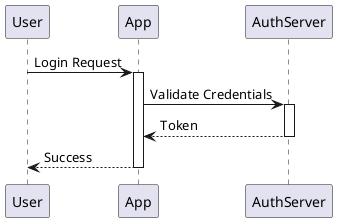
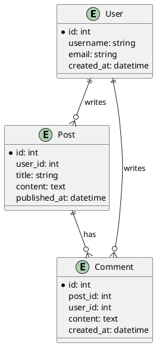
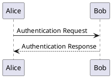
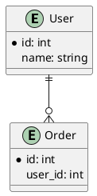

# PlantUML Claude Skill

[](https://claude.ai/code)
[](https://plantuml.com/)
[](LICENSE)

A comprehensive Claude Code skill for generating PlantUML diagrams from text descriptions, converting source code to architecture diagrams, and processing markdown files. This skill supports all 19 PlantUML diagram types with enhanced features for real-world development workflows.

## Installing with Skilz

Install this skill using the Skilz universal installer:

```bash
skilz install SpillwaveSolutions_plantuml/plantuml
```

Or install directly from GitHub:

```bash
skilz install https://github.com/SpillwaveSolutions/plantuml
```

Browse and explore this skill on the Skilz marketplace:
[View on Skilz Marketplace](https://skillzwave.ai/skill/SpillwaveSolutions__plantuml__plantuml__SKILL/)

## Features

- **Generate diagrams from natural language** - Describe what you want, get PlantUML syntax
- **Convert source code to diagrams** - Spring Boot, FastAPI, Python ETL, Node.js, React examples
- **Convert `.puml` files to images** - Generate PNG or SVG from standalone PlantUML files
- **Extract diagrams from markdown** - Process both embedded `puml` blocks AND linked .puml files
- **Unicode symbol enrichment** - Add semantic meaning with security, data, and system symbols
- **Validate PlantUML syntax** - CI/CD-ready validation without conversion
- **IDE-friendly workflow** - Link to .puml files for IDE preview, convert for publication
- **Confluence-ready output** - Convert PlantUML to images for doc systems without native support
- **Comprehensive diagram support** - All UML (sequence, class, activity, state, etc.) and non-UML types (ER, Gantt, mindmap, etc.)
- **Modern styling** - CSS-like `<style>` syntax for professional diagram appearance

## Quick Start

### 1. Verify Setup

Check that Java, Graphviz, and plantuml.jar are installed:

```bash
python scripts/check_setup.py
```

### 2. Convert a PlantUML File

```bash
# Convert to PNG
python scripts/convert_puml.py my_diagram.puml

# Convert to SVG
python scripts/convert_puml.py my_diagram.puml --format svg --output-dir images/
```

### 3. Process Markdown with PlantUML

```bash
# Process both embedded puml blocks AND linked  files
python scripts/process_markdown_puml.py article.md

# Validate syntax without converting (great for CI/CD)
python scripts/process_markdown_puml.py article.md --validate

# Convert to SVG format
python scripts/process_markdown_puml.py article.md --format svg
```

## Requirements

### Prerequisites

1. **Java** (JRE 8 or higher)
   - Download from [Oracle](https://www.oracle.com/java/technologies/downloads/)
   - Verify: `java -version`

2. **plantuml.jar**
   - Download from [PlantUML](https://plantuml.com/download)
   - Place in one of these locations:
     - `~/plantuml.jar`
     - `/usr/local/bin/plantuml.jar`
     - Or set `PLANTUML_JAR` environment variable

3. **Graphviz** (recommended, required for most UML diagrams)
   - Download from [Graphviz](https://graphviz.org/download/)
   - Add `dot` executable to PATH

### Quick Setup

```bash
# macOS (with Homebrew)
brew install java graphviz
curl -o ~/plantuml.jar https://downloads.sourceforge.net/project/plantuml/plantuml.jar

# Ubuntu/Debian
sudo apt install default-jre graphviz
wget -O ~/plantuml.jar https://downloads.sourceforge.net/project/plantuml/plantuml.jar

# Verify installation
python scripts/check_setup.py
```

## Code-to-Diagram Examples

Convert real-world application architectures to PlantUML diagrams with comprehensive examples in `examples/`:

| Framework | Description | Examples |
|-----------|-------------|----------|
| **Spring Boot** | AWS ECS deployment, component architecture, REST API sequence flows | `examples/spring-boot/` |
| **FastAPI** | Kubernetes deployment, async architecture, Pydantic validation flows | `examples/fastapi/` |
| **Python ETL** | Complete pipeline with Airflow, data quality, monitoring | `examples/python-etl/` |
| **Node.js** | Express/Nest.js component diagrams | `examples/nodejs-web/` |
| **React** | SPA deployment (S3 + CloudFront), component architecture | `examples/react-frontend/` |

Each example includes deployment, component, and sequence diagrams with production-ready patterns.

## Unicode Symbol Enrichment

Enhance diagrams with semantic Unicode symbols (see `references/unicode_symbols.md`):

```puml
node "AWS Cloud" as aws
component "Security Service" as security
database "PostgreSQL" as db
queue "RabbitMQ" as mq
component "FastAPI App" as api
```

**Symbol categories**: Web, Data, Security, System, Messaging, Languages, Cloud, Processing, Monitoring

## Linked .puml Files Support

Reference external `.puml` files in markdown for IDE-friendly workflows:

```markdown
## Architecture


```

**Benefits:**
- IDEs with PlantUML support render diagrams in preview
- Version control tracks diagram changes separately
- Reuse diagrams across multiple markdown files
- Better code reviews (diff .puml files directly)
- Same script converts both embedded and linked diagrams

## Usage Examples

### Example 1: Create a Sequence Diagram

Create `auth_flow.puml`:



Convert to image:

```bash
python scripts/convert_puml.py auth_flow.puml --format svg
```

### Example 2: Create an ER Diagram

Create `blog_schema.puml`:



### Example 3: Process Markdown with Multiple Diagrams

Create `article.md`:

````markdown
# System Architecture

## Authentication Flow



## Database Schema


````

Process the file:

```bash
python scripts/extract_and_convert_puml.py article.md --format png
```

This creates:
- `article_with_images.md` - Updated markdown with image links
- `images/diagram_1_uml.png` - First diagram
- `images/diagram_2_uml.png` - Second diagram

## Supported Diagram Types

### UML Diagrams

| Type | Description |
|------|-------------|
| **Sequence** | Interactions between participants over time |
| **Use Case** | System features and actors |
| **Class** | Object-oriented structure |
| **Object** | Runtime instances |
| **Activity** | Workflows and processes |
| **Component** | System modules |
| **Deployment** | Physical architecture |
| **State** | State machines and transitions |
| **Timing** | State changes over time |

### Non-UML Diagrams

| Type | Description |
|------|-------------|
| **Entity-Relationship (ER)** | Database schemas |
| **Network** | Network topology |
| **Wireframes (Salt)** | UI mockups |
| **Ditaa** | ASCII art diagrams |
| **Work Breakdown Structure (WBS)** | Project tasks |
| **MindMap** | Hierarchical information |
| **Gantt** | Project timelines |
| **JSON/YAML** | Data visualization |
| **Archimate** | Enterprise architecture |
| **Timeline** | Chronological events |

## Scripts Reference

### check_setup.py

Validates PlantUML environment setup.

```bash
python scripts/check_setup.py
```

Checks:
- Java installation and version
- Graphviz availability
- plantuml.jar location
- Runs test diagram conversion

### convert_puml.py

Converts standalone `.puml` files to images.

```bash
python scripts/convert_puml.py <file.puml> [options]

Options:
  --format png|svg       Output format (default: png)
  --output-dir <path>    Directory for output images (default: same as input)
```

### process_markdown_puml.py

Enhanced markdown processor supporting both embedded code blocks AND linked `.puml` files.

```bash
python scripts/process_markdown_puml.py <file.md> [options]

Options:
  --format png|svg       Output format (default: png)
  --output-dir <path>    Directory for images (default: images/)
  --validate             Validate syntax without converting (CI/CD mode)
```

**Key advantages:**
- Supports IDE-friendly workflow (link to external .puml files)
- Validates syntax before conversion
- CI/CD ready with `--validate` flag
- Processes both embedded and linked diagrams in single pass
- Better error messages with line numbers

### extract_and_convert_puml.py (Legacy)

> **Note**: Consider using `process_markdown_puml.py` for enhanced features.

Extracts PlantUML diagrams from markdown and converts to images.

```bash
python scripts/extract_and_convert_puml.py <file.md> [options]

Options:
  --format png|svg       Output format (default: png)
  --output-dir <path>    Directory for images (default: images/)
```

## Advanced Usage

### Direct PlantUML Commands

```bash
# Basic PNG conversion
java -jar ~/plantuml.jar diagram.puml

# SVG output
java -jar ~/plantuml.jar --svg diagram.puml

# Batch convert all .puml files
java -jar ~/plantuml.jar "**/*.puml" --svg --output-dir images/

# Check syntax without converting
java -jar ~/plantuml.jar --check-syntax diagram.puml

# Pipe input
echo "@startuml Alice->Bob @enduml" | java -jar ~/plantuml.jar -pipe --svg > output.svg
```

### Modern Styling

```puml
@startuml
<style>
classDiagram {
  class {
    BackgroundColor LightBlue
    BorderColor Navy
    FontColor DarkBlue
    FontSize 14
  }
  arrow {
    LineColor SeaGreen
    LineThickness 2
  }
}
</style>

class Animal {
  -name: String
  +move()
}
class Dog extends Animal {
  +bark()
}
Animal <|-- Dog
@enduml
```

Use CSS-like `<style>` syntax for professional appearance:



### Themes

Quick styling with built-in themes:

```puml
@startuml
!theme cerulean

' Your diagram content
@enduml
```

Available themes: `cerulean`, `bluegray`, `plain`, `sketchy`, `amiga`

## Documentation

The `references/` directory contains comprehensive guides:

### Core References

- **[toc.md](references/toc.md)** - Navigation hub for all diagram types
- **[plantuml_reference.md](references/plantuml_reference.md)** - Installation, CLI, troubleshooting
- **[common_format.md](references/common_format.md)** - Universal syntax elements
- **[styling_guide.md](references/styling_guide.md)** - Modern `<style>` syntax guide
- **[unicode_symbols.md](references/unicode_symbols.md)** - Complete Unicode symbol guide for semantic enrichment

### Diagram Type Guides

- [sequence_diagrams.md](references/sequence_diagrams.md)
- [class_diagrams.md](references/class_diagrams.md)
- And more for each diagram type...

### Code Examples

| Directory | Description |
|-----------|-------------|
| `examples/spring-boot/` | Spring Boot deployment, component, and sequence diagrams |
| `examples/fastapi/` | FastAPI Kubernetes deployment and async architecture |
| `examples/python-etl/` | Python ETL pipeline architecture with Airflow |
| `examples/nodejs-web/` | Node.js/Express component diagrams |
| `examples/react-frontend/` | React SPA deployment diagrams |

## Troubleshooting

### "plantuml.jar not found"

- Download from https://plantuml.com/download
- Place in `~/plantuml.jar` or set `PLANTUML_JAR` environment variable
- Verify: `python scripts/check_setup.py`

### "Graphviz not found"

- Install from https://graphviz.org/download/
- Add `dot` executable to PATH
- Some diagrams (JSON, YAML, Gantt, MindMap) don't require Graphviz

### "Syntax Error?"

- Verify `@start`/`@end` delimiters match
- Check diagram-specific syntax in `references/[diagram_type].md`
- Use `java -jar plantuml.jar --check-syntax file.puml`

### "Java not found"

- Install Java JRE/JDK 8+
- Add to PATH
- Verify: `java -version`

## Tips and Best Practices

1. **Use descriptive filenames** - `user_auth_sequence.puml` instead of `diagram1.puml`
2. **Add comments** - Use `'` for single-line comments to document complex logic
3. **Choose SVG for documentation** - Scalable, better quality, supports hyperlinks
4. **Use PNG for web** - Smaller file sizes, fixed resolution
5. **Start simple** - Test basic diagrams before adding complexity
6. **Version control** - Commit `.puml` source files to Git
7. **Prefer modern styling** - Use `<style>` tags instead of legacy `skinparam`

## Use with Claude Code

This is a Claude Code skill. When loaded, Claude can:

- Generate PlantUML syntax from natural language descriptions
- Select the appropriate diagram type for your use case
- Create properly formatted `.puml` files
- Convert diagrams to images
- Extract and process diagrams from markdown files
- Apply modern styling for professional appearance

Simply describe what you want: *"Create a sequence diagram for user authentication"* or *"Extract all diagrams from my article.md and convert to SVG"*.

## Resources

- [PlantUML Official Site](https://plantuml.com/)
- [PlantUML Language Reference Guide (PDF)](https://pdf.plantuml.net/PlantUML_Language_Reference_Guide_en.pdf)
- [PlantUML GitHub](https://github.com/plantuml/plantuml)
- [Graphviz Downloads](https://graphviz.org/download/)

## License

This skill is provided as-is for use with Claude Code.
