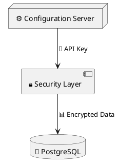

# Unicode Symbols for PlantUML Diagrams

This guide provides a comprehensive collection of Unicode symbols for semantic enrichment in PlantUML diagrams. Using meaningful glyphs enhances clarity and expressiveness without cluttering diagrams with excessive text.

## Usage in PlantUML

Unicode characters can be used in:
- Node labels
- Component names
- Entity names
- Comments and notes
- State names
- Any text element

Always enclose labels with symbols in double quotes to ensure proper rendering:



## Symbol Categories

### 🌐 Web & Network

| Symbol | Meaning | Use Case |
|--------|---------|----------|
| 🌐 | Web/Internet | Internet gateway, public endpoints |
| 🌍 🌎 🌏 | Global | Multi-region deployment, worldwide |
| 📡 | Communication | Network communication, broadcasting |
| 🔗 | Link/Connection | HTTP links, API connections |
| 🌉 | Bridge | Network bridge, gateway |
| 🚀 | Deployment | Service deployment, launch |
| ⚡ | Fast/Lightning | High-performance, async operations |
| 🔌 | Plugin/Integration | External integrations, adapters |
| 📶 | Signal | Network signal, connectivity |
| 🛰️ | Satellite | CDN, distributed services |

### 💾 Data & Storage

| Symbol | Meaning | Use Case |
|--------|---------|----------|
| 💾 | Database | General database, data storage |
| 🗄️ | File Cabinet | Data warehouse, archive |
| 📊 | Charts/Analytics | Analytics database, BI tools |
| 📈 | Trending Up | Metrics growth, time-series data |
| 📉 | Trending Down | Metrics decline, degradation |
| 💿 | Disk | Persistent storage, volumes |
| 📁 | Folder | File system, S3 buckets |
| 📂 | Open Folder | Active directory, mounted volume |
| 📄 | Document | File, document store |
| 📝 | Memo | Log files, audit trails |
| 🗃️ | Card File Box | Index, catalog, metadata |
| 💽 | Floppy Disk | Legacy storage, backup |
| 🎞️ | Film Frames | Streaming data, video |
| 📦 | Package | Repository, artifact storage |

### 🔒 Security & Authentication

| Symbol | Meaning | Use Case |
|--------|---------|----------|
| 🔒 | Lock/Secure | Security layer, encryption |
| 🔓 | Unlocked | Public access, no auth |
| 🔐 | Locked with Key | Authenticated access |
| 🔑 | Key | API key, credentials |
| 🛡️ | Shield | Firewall, protection |
| ⚔️ | Crossed Swords | Security conflict, attack |
| 🎫 | Ticket | Session ticket, token |
| 🏷️ | Tag | Labels, tags, metadata |
| 👤 | User | User account, identity |
| 👥 | Users | User group, team |
| 🎭 | Masks | Role-based access, personas |
| 🚨 | Alert | Security alert, incident |
| ⚠️ | Warning | Security warning, caution |

### ⚙️ System & Configuration

| Symbol | Meaning | Use Case |
|--------|---------|----------|
| ⚙️ | Gear/Settings | Configuration, system settings |
| 🔧 | Wrench | Maintenance, tools |
| 🔨 | Hammer | Build process, compilation |
| 🛠️ | Tools | DevOps tools, utilities |
| ⚗️ | Alembic | Data transformation, ETL |
| 🎛️ | Control Knobs | Control plane, parameters |
| 📟 | Pager | Monitoring, alerts |
| 🖥️ | Desktop | Server, compute instance |
| 💻 | Laptop | Client device, workstation |
| 🖨️ | Printer | Report generation, output |
| 📠 | Fax | Legacy integration |
| ⏱️ | Stopwatch | Timer, scheduled tasks |
| ⏰ | Alarm Clock | Cron jobs, alerts |
| 🕐 | Clock | Timestamp, time-based |

### 📬 Messaging & Events

| Symbol | Meaning | Use Case |
|--------|---------|----------|
| 📬 | Mailbox | Message queue, inbox |
| 📭 | Empty Mailbox | Drained queue |
| 📮 | Postbox | Message publishing |
| 📨 | Incoming Email | Incoming messages |
| 📩 | Envelope with Arrow | Message sending |
| 📫 | Mailbox with Flag | Message notification |
| 💌 | Love Letter | Priority message |
| 📢 | Loudspeaker | Broadcasting, pub-sub |
| 📣 | Megaphone | Event publishing |
| 🔔 | Bell | Notification, webhook |
| 🔕 | Bell with Slash | Muted notifications |
| 📞 | Phone | Synchronous call, RPC |
| 📲 | Mobile Phone | Push notification |

### 🎯 Application Components

| Symbol | Meaning | Use Case |
|--------|---------|----------|
| 🎯 | Target/Endpoint | API endpoint, target service |
| 🎪 | Circus Tent | Service mesh, orchestration |
| 🎬 | Clapperboard | Action trigger, event |
| 🎮 | Game Controller | Interactive service |
| 🎰 | Slot Machine | Random selection, lottery |
| 🎲 | Dice | Random, non-deterministic |
| 🃏 | Joker Card | Wildcard, fallback |
| 🎨 | Art Palette | UI components, frontend |
| 🖼️ | Frame | Container, boundary |
| 📐 | Triangular Ruler | Geometry, layout |
| 📏 | Ruler | Measurement, metrics |
| 🔬 | Microscope | Testing, analysis |
| 🔭 | Telescope | Monitoring, observability |
| 🧪 | Test Tube | Testing, experiments |

### 💼 Business Logic

| Symbol | Meaning | Use Case |
|--------|---------|----------|
| 💼 | Briefcase | Business logic, service layer |
| 💰 | Money Bag | Payment, billing |
| 💳 | Credit Card | Payment processing |
| 💵 | Dollar Bill | Currency, financial |
| 🏦 | Bank | Financial services |
| 🏪 | Store | E-commerce, shop |
| 🛒 | Shopping Cart | Cart service |
| 🛍️ | Shopping Bags | Order, purchase |
| 📦 | Package | Shipping, logistics |
| 🚚 | Delivery Truck | Shipping service |
| 📋 | Clipboard | Forms, data entry |
| ✅ | Check Mark | Validation success |
| ❌ | Cross Mark | Validation failure |
| ⭐ | Star | Favorite, featured |
| 🏆 | Trophy | Achievement, reward |

### 🐍 Language & Framework Symbols

| Symbol | Meaning | Use Case |
|--------|---------|----------|
| 🐍 | Python | Python application |
| ☕ | Coffee | Java application |
| 🟢 | Green Circle | Node.js |
| 🌱 | Seedling | Spring Boot |
| ⚛️ | Atom | React |
| 🔺 | Red Triangle | Angular |
| 🔷 | Blue Diamond | Vue.js |
| 🦀 | Crab | Rust |
| 🐹 | Hamster | Go (Golang) |
| 💎 | Gem | Ruby |
| 🐘 | Elephant | PHP, PostgreSQL |
| 🐬 | Dolphin | MySQL |
| 🍃 | Leaf | MongoDB |
| 🔥 | Fire | Firebase |
| ⚙️ | Gear | C/C++ |

### ☁️ Cloud Providers

| Symbol | Meaning | Use Case |
|--------|---------|----------|
| ☁️ | Cloud | Generic cloud |
| 🅰️ | A Button | AWS |
| 🔵 | Blue Circle | Azure |
| 🟢 | Green Circle | Google Cloud |
| 🌊 | Water Wave | DigitalOcean |
| 🎈 | Balloon | Heroku |
| 📦 | Package | Docker container |
| ☸️ | Wheel | Kubernetes |
| 🐳 | Whale | Docker |
| 🎻 | Violin | Terraform |
| 🏗️ | Construction | CloudFormation |
| ⚡ | Lightning | Serverless |
| 🔧 | Wrench | Ansible |
| 🐙 | Octopus | GitHub |

### 🔄 Processing & Flow

| Symbol | Meaning | Use Case |
|--------|---------|----------|
| 🔄 | Counterclockwise | Refresh, retry, loop |
| ♻️ | Recycling | Reprocessing, queue retry |
| 🔀 | Shuffle | Random processing, load balancing |
| 🔁 | Repeat | Continuous processing |
| ➡️ | Right Arrow | Forward flow |
| ⬅️ | Left Arrow | Backward flow |
| ⬆️ | Up Arrow | Upload, escalation |
| ⬇️ | Down Arrow | Download, degradation |
| ↗️ | Up-Right Arrow | Scaling up |
| ↘️ | Down-Right Arrow | Scaling down |
| 🔃 | Clockwise | Rotation, round-robin |
| ⚡ | Lightning | Async/await, fast path |
| 🐌 | Snail | Slow path, throttling |
| ⏸️ | Pause | Circuit breaker open |
| ⏹️ | Stop | Service stopped |
| ▶️ | Play | Service running |
| ⏭️ | Next | Skip, bypass |

### 📊 Monitoring & Observability

| Symbol | Meaning | Use Case |
|--------|---------|----------|
| 📊 | Chart | Metrics dashboard |
| 📈 | Increasing | Performance improving |
| 📉 | Decreasing | Performance degrading |
| 🔍 | Magnifying Glass | Search, inspection |
| 🔎 | Magnifying Right | Deep inspection |
| 👁️ | Eye | Observability, watching |
| 🎯 | Target | SLO/SLA target |
| 📡 | Satellite | Telemetry |
| 🚦 | Traffic Light | Health status |
| 🟢 | Green Circle | Healthy |
| 🟡 | Yellow Circle | Warning |
| 🔴 | Red Circle | Critical |
| 💚 | Green Heart | Service up |
| ❤️ | Red Heart | Service critical |

## Best Practices

### 1. Consistency
Use the same symbol for the same concept throughout your diagrams:
```puml
' Good - Consistent use
component "🔒 Auth Service" as auth
component "🔒 OAuth Provider" as oauth

' Avoid - Inconsistent symbols
component "🔒 Auth Service" as auth
component "🔐 OAuth Provider" as oauth  // Different lock symbol
```

### 2. Context-Appropriate Symbols
Choose symbols that match the business or technical context:
```puml
' E-commerce context
component "🛒 Shopping Cart" as cart
component "💳 Payment Gateway" as payment
component "📦 Order Service" as orders

' Banking context
component "💰 Account Service" as account
component "🏦 Transaction Service" as txn
component "💳 Card Management" as cards
```

### 3. Avoid Overuse
Don't use too many different symbols in one diagram - it becomes cluttered:
```puml
' Good - Selective use
component "🎯 API Gateway" as api
component "💼 User Service" as user
database "💾 PostgreSQL" as db

' Avoid - Too many symbols
component "🎯⚡🌐 API Gateway" as api  // Too much!
```

### 4. Combine with Text
Symbols enhance text, not replace it:
```puml
' Good
component "🔒 Security Service\nJWT Validation" as security

' Avoid - Symbol only
component "🔒" as security  // Ambiguous
```

### 5. Use in Notes for Emphasis
```puml
note right of component
  ⚠️ Warning: Legacy component
  🔄 Scheduled for replacement
  📅 Timeline: Q2 2025
end note
```

## Common Patterns by Diagram Type

### Deployment Diagrams
```puml
node "☁️ AWS Cloud" as aws
node "🖥️ EC2 Instance" as ec2
database "💾 RDS PostgreSQL" as rds
storage "📁 S3 Bucket" as s3
node "⚖️ Load Balancer" as lb
```

### Component Diagrams
```puml
component "🎯 API Layer" as api
component "💼 Business Logic" as logic
component "📦 Data Access" as data
component "🔒 Security" as security
```

### Sequence Diagrams
```puml
actor "👤 User" as user
participant "🌐 API Gateway" as api
participant "🔒 Auth Service" as auth
database "💾 Database" as db
queue "📬 Message Queue" as mq
```

### State Diagrams
```puml
[*] --> ⏸️Pending
⏸️Pending --> ▶️Processing : Start
▶️Processing --> ✅Completed : Success
▶️Processing --> ❌Failed : Error
❌Failed --> 🔄Retrying : Retry
```

## Framework-Specific Examples

### Spring Boot
```puml
component "🌱 Spring Boot App" as app {
  [🎯 @RestController] as controller
  [💼 @Service] as service
  [📦 @Repository] as repo
  [⚙️ @Configuration] as config
}
```

### FastAPI
```puml
component "⚡ FastAPI App" as app {
  [🎯 APIRouter] as router
  [🔒 OAuth2] as oauth
  [📝 Pydantic Models] as models
  [💾 SQLAlchemy] as orm
}
```

### React
```puml
component "⚛️ React Frontend" as react {
  [🎨 Components] as components
  [🗂️ State Management] as state
  [🔌 API Client] as client
}
```

### Python ETL
```puml
component "🐍 ETL Pipeline" as etl {
  [📥 Extract] as extract
  [⚗️ Transform] as transform
  [📤 Load] as load
  [✅ Validate] as validate
}
```

## Symbol Reference Quick Links

- [Unicode Full Emoji List](https://unicode.org/emoji/charts/full-emoji-list.html)
- [Emojipedia](https://emojipedia.org/)
- [Unicode Character Table](https://unicode-table.com/)

## Copy-Paste Symbol Collections

### Quick DevOps Set
```
☁️ 🐳 ☸️ 📦 🚀 ⚙️ 🔧 🛠️ 📊 📈 🔍 🚦 🟢 🟡 🔴
```

### Quick Security Set
```
🔒 🔓 🔑 🛡️ 🎫 👤 👥 ⚠️ 🚨 🔐
```

### Quick Data Set
```
💾 🗄️ 📊 📈 📉 💿 📁 📄 📝 🗃️ 💽
```

### Quick Network Set
```
🌐 📡 🔗 🌉 🔌 📶 🛰️ ⚡
```

### Quick Cloud Set
```
☁️ 🅰️ 🔵 🟢 🌊 🎈 ⚡ 🏗️
```

### Quick Language Set
```
🐍 ☕ 🟢 🌱 ⚛️ 🔺 🔷 🦀 🐹 💎 🐘 🐬 🍃
```

